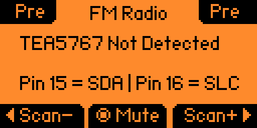
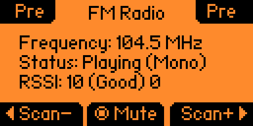

# FM Radio - Flipper Zero

FM radio app for the Flipper Zero that controls external FM tuner boards over I2C. Supports **TEA5767** and **Si4703** chips with automatic detection.

 

## Features

- **Dual chip support** — auto-detects TEA5767 or Si4703 at startup (or force a chip in Settings)
- Region-based station lists loaded from SD card (auto-creates defaults if missing)
- Preset up/down with on-screen indicators
- Seek up/down with adjustable seek strength (1–15)
- Fine tuning in 0.1 MHz steps (Tuner view)
- Audio mode: Stereo / Mono (Left) / Mono (Right)
- Mute on exit (standby behavior) toggle
- In-app station file viewer
- All settings saved to SD card

## Supported Boards

| Chip | Datasheet |
|------|-----------|
| TEA5767 | [Datasheet](https://www.sparkfun.com/datasheets/Wireless/General/TEA5767.pdf) |
| Si4703 | [Datasheet](https://www.sparkfun.com/datasheets/BreakoutBoards/Si4702-03-C19-1.pdf) |

## Wiring

### TEA5767
| Signal | Flipper Pin |
|--------|-------------|
| VCC | 3V3 (Pin 9) |
| GND | GND (Pin 18) |
| SCL (SCLK) | C0 (Pin 16) |
| SDA (SDIO) | C1 (Pin 15) |

### Si4703
| Signal | Flipper Pin |
|--------|-------------|
| VCC | 3V3 (Pin 9) |
| GND | GND (Pin 18) |
| SCL (SCLK) | C0 (Pin 16) |
| SDA (SDIO) | C1 (Pin 15) |
| RST | A4 (Pin 4) — **required** |
| SEN | tie to 3.3V (selects I2C mode; tied HIGH on most breakouts) |

> **Note:** The Si4703 will not respond on I2C without the RST pin wired — it needs a special powerup sequence (SDIO held low while RST rises).

A full Flipper Zero pinout diagram is in [docs/flipper-zero-pinout.jpg](docs/flipper-zero-pinout.jpg).

## Controls (Listen Now)

| Button | Action |
|--------|--------|
| Up | Preset Up ▲ |
| Down | Preset Down ▼ |
| Left | Seek Down |
| Right | Seek Up |
| OK | Toggle Mute |

In the **Tuner** view, Left/Right fine-tune in 0.1 MHz steps and Up/Down auto-seek.

## Station Lists

Station lists are `.txt` files on your SD card at:
```
/ext/apps_data/fm_radio/
```

Default files (auto-generated if missing):
- `toronto.txt` — Toronto, Canada
- `usa.txt` — USA major cities
- `europe.txt` — Europe general
- `custom.txt` — edit this for your own stations!

Format, one station per line (up to 100 per region):
```
88.5|Cool FM
95.3|Rock Station
101.1|Jazz Radio
# Lines starting with # are comments
```

To change regions: open the app → **Settings** → choose your region. Use **Station Files** in the main menu to browse each region file in-app.

## Settings

| Setting | Description |
|---------|-------------|
| Chip Select | Auto (detect) / TEA5767 / Si4703 |
| Region | Which station list to load |
| Mute On Exit | On = radio goes to standby when you exit; Off = keeps playing |
| Seek Strength (1–15) | Lower = finds weaker stations, higher = only strong stations (default 7) |
| Audio Mode | Stereo / Mono (Left) / Mono (Right) — Si4703 supports Stereo/Mono only |

Settings are saved automatically to `/ext/apps_data/fm_radio/settings.cfg`.

## Building

Build with [ufbt](https://github.com/flipperdevices/flipperzero-ufbt) from the project directory:
```
ufbt
```
To build and launch on a connected Flipper:
```
ufbt launch
```

## Documentation

- [DUAL_CHIP_SUPPORT.md](DUAL_CHIP_SUPPORT.md) — how dual-chip detection and the unified radio API work
- [docs/si4703-datasheet.pdf](docs/si4703-datasheet.pdf) — Si4703 chip reference
- [docs/arduino-reference-Si4703.ino](docs/arduino-reference-Si4703.ino) — Arduino reference sketch used during Si4703 driver development

## Changelog

### v2.0
- **Si4703 support** with automatic chip detection (TEA5767 still fully supported)
- Chip Select setting (Auto / TEA5767 / Si4703)
- Unified radio API routing to the detected chip
- Signal display shows chip type
- Updated wiring docs and error screens

### v1.1
- Settings menu with region selection
- Station lists load from SD card (.txt files), auto-generates defaults
- Mute On Exit toggle
- Adjustable RSSI seek strength (1–15)
- Audio mode selection (Stereo / Mono-L / Mono-R)
- Preset up/down icons
- Station files viewer

### v1.0
- Reformatted code
- Added station names

### v0.8
- Created TEA5767 library and first functioning app

## Roadmap

- Redirect TEA5767 audio to a GPIO and play back on the Flipper internal speaker
- Favorite station marking
- Recent stations history
- RDS support (Si4703)

## License

GPLv3

## Created By

Coolshrimp — https://CoolshrimpModz.com
